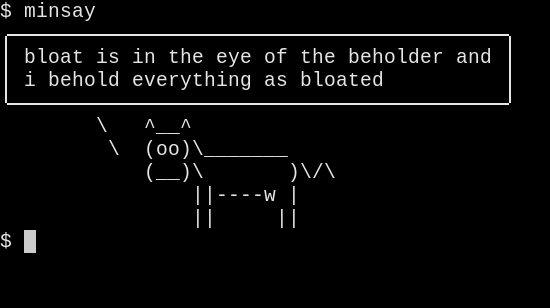

# \[ minsay \]

> *A partially satirical fortune+cowsay clone featuring quotes from the area of UNIX-hacker culture nihilism*



## >> WHY? >>

The modern UNIXoids are unaware of the majestic beauty of digital nihilism.

This philosophy is being written off by normies who are unaware of the humongous amounts of corporate representation in modern software and how much of an impact it actually makes.

I used to be one of the one of the deniers in the past, but that was before I found enlightenment and started cherishing it.

## >> WHAT? >>

This is a stupidly-implemented Rust program that emulates the behaviour of running `fortune | cowsay` in your terminal, except with a hardcoded quote database.

It has no UTF-8 support, no proper special character handling, no customisation. The only good part of it are the quotes, which I've gathered from various sources including, but not limited to:

- About pages of various software
- Cat-v.org
- Lobsters
- Random blogposts
- Reddit
- The UNIX-HATERS Handbook

## >> INSTALLATION >>

*There are no OS-specific packages being shipped*

Installing from the git repo:
```shell
git clone https://codeberg.org/diviocity/minsay.git
cd minsay
cargo install --path .
```
